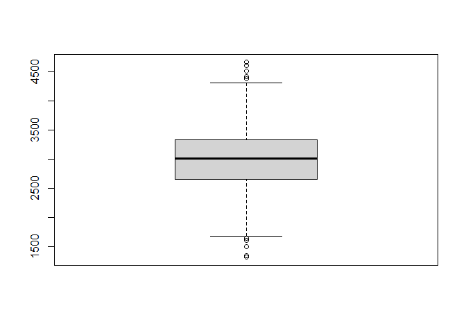

Punto de partida
----------------

Abrimos la base de datos LAPOP desde nuestro repositorio:

    library(rio)
    link="https://github.com/DataPolitica/salidas/raw/master/Data/sub_lapop.sav"
    lapop=import(link)

*Seleccionamos la variable ingresos*

1. Estadísticos descriptivos de una numérica
--------------------------------------------

Solicitar la función `summary()` y vamos a ver que el resultado variable
significativamente de los resultados de las variables categóricas:

    summary(lapop$ingresos)

    ##    Min. 1st Qu.  Median    Mean 3rd Qu.    Max. 
    ##    1316    2661    3010    3012    3341    4667

Como vemos, el summary ahora nos muestra los principales estadísticos de
una variable numérica, es decir: mínimo, 1er cuartil, mediana, media o
promedio, 3er cuartil y máximo. Siempre que tengamos una variable
numérica comencemos por solicitar esta función.

2. Estadísticos de dispersión
-----------------------------

La lógica es la misma, colocamos la función y entre paréntesis el nombre
de la variable:

Si deseamos la desviación estándar utilizamos la función `sd()`:

    sd(lapop$ingresos)

    ## [1] 498.6063

Si deseamos la varianza utilizamos la función `var()`:

    var(lapop$ingresos)

    ## [1] 248608.3

También podemos pedir estadísticos de dispersión.

Para solicitar la asimetría y curtosis primero abrimos el paquete
`e1071`:

    library(e1071)

Para la asimetría utilizamos la función `skewness()`:

    skewness(lapop$ingresos)

    ## [1] 0.0544436

Para la curtosis utilizamos la función `kurtosis()`:

    kurtosis(lapop$ingresos)

    ## [1] -0.0678835

2. Análisis gráfico de una variable numérica
--------------------------------------------

En este caso, como estamos ante una variable numérica, no necesitamos
crear una tabla antes de solicitar los gráficos.

-   Histograma

Solicitemos un histograma con la función `hist()`:

    hist(lapop$ingresos)

-   Diagrama de cajas o **boxplot**

Solicitemos un diagrama de cajas con la función `boxplot()`:

    boxplot(lapop$ingresos)

