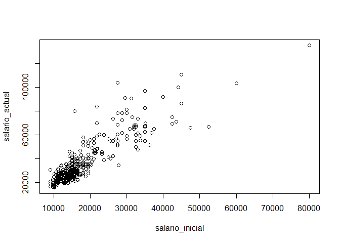

R Markdown
----------

    library(rio)
    base_trabajadores="https://github.com/DataPolitica/salidas/raw/master/Data/trabajadores.sav"
    trabajadores=import(base_trabajadores)
    attach(trabajadores)

    names(trabajadores)

    ##  [1] "id"              "sexo"            "fechnac"         "educ"           
    ##  [5] "catlab"          "salario_actual"  "salario_inicial" "antiguedad"     
    ##  [9] "experiencia"     "minoría"         "directivo"

    plot(salario_actual~salario_inicial)

    cor.test(salario_actual,salario_inicial)

    ## 
    ##  Pearson's product-moment correlation
    ## 
    ## data:  salario_actual and salario_inicial
    ## t = 40.276, df = 472, p-value < 2.2e-16
    ## alternative hypothesis: true correlation is not equal to 0
    ## 95 percent confidence interval:
    ##  0.8580696 0.8989267
    ## sample estimates:
    ##       cor 
    ## 0.8801175

    modelo1=lm(salario_actual~salario_inicial,data=trabajadores)
    summary(modelo1)

    ## 
    ## Call:
    ## lm(formula = salario_actual ~ salario_inicial, data = trabajadores)
    ## 
    ## Residuals:
    ##    Min     1Q Median     3Q    Max 
    ## -35424  -4031  -1154   2584  49293 
    ## 
    ## Coefficients:
    ##                  Estimate Std. Error t value Pr(>|t|)    
    ## (Intercept)     1.928e+03  8.887e+02    2.17   0.0305 *  
    ## salario_inicial 1.909e+00  4.741e-02   40.28   <2e-16 ***
    ## ---
    ## Signif. codes:  0 '***' 0.001 '**' 0.01 '*' 0.05 '.' 0.1 ' ' 1
    ## 
    ## Residual standard error: 8115 on 472 degrees of freedom
    ## Multiple R-squared:  0.7746, Adjusted R-squared:  0.7741 
    ## F-statistic:  1622 on 1 and 472 DF,  p-value: < 2.2e-16

Note that the `echo = FALSE` parameter was added to the code chunk to
prevent printing of the R code that generated the plot.
